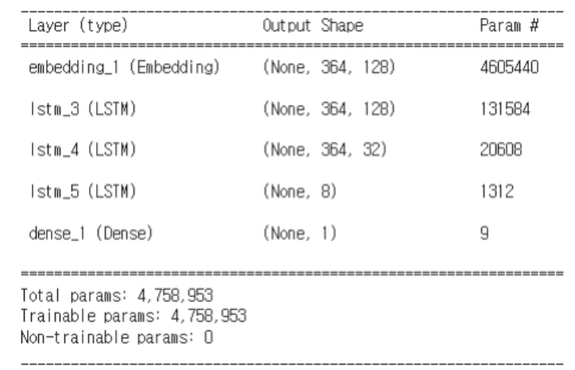

# Spam_mail_Filtering

광운대학교 소프트웨어학부

__2014405048 이유웅__

__2017203066 송도훈__ 의 졸업작품 프로젝트 입니다.

### 개요

한글 스팸 메시지를 머신러닝을 이용하여 필터링 하는 모델 구현

### 사용한 DataSet
Spam - KT 통신 빅데이터 플랫폼 '휴대전화 스팸트랩 문자 수집 내역'
Ham - AI Hub '한국어 SNS'

### Preprocessing
Tokenizer - soynlp, keras

### Model

